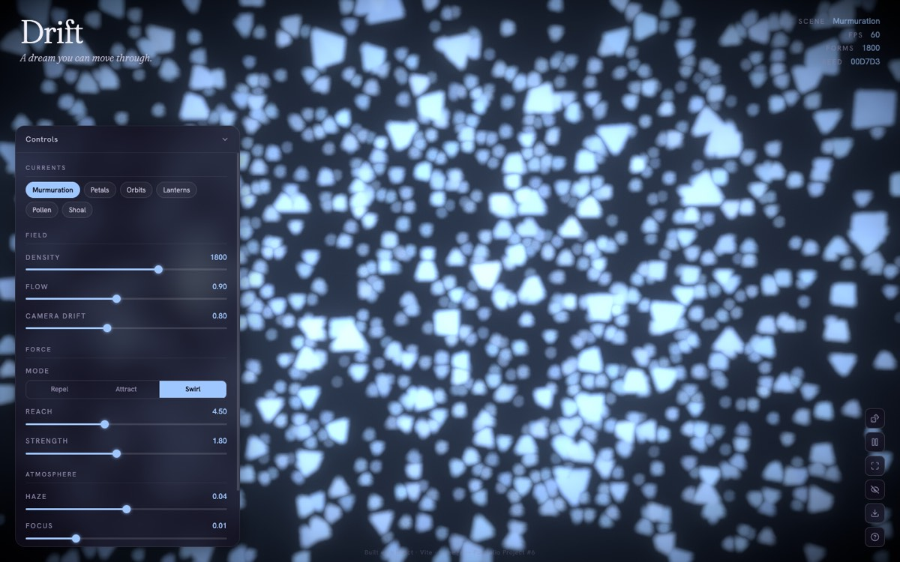

# Drift

> A 3D dreamscape you move through — instanced spring-physics, bloom & bokeh. react-three-fiber.

**[Live demo](https://drift.ayoubalkak.com)** · part of [my portfolio](https://ayoubalkak.com)



## What it is

A real-time 3D field of thousands of glowing forms suspended in luminous fog — a dream you can move through. Your cursor is a current: forms scatter on approach and spring back when you leave. The differentiator is doing this at 60fps with real physics and a cinematic post chain, not a canvas particle gif.

## How it works

- The field is a single `instancedMesh` (`DriftField.jsx`) — one draw call for the whole particle population, with per-particle positions and velocities integrated each frame.
- Cursor interaction is real raycasting, not a screen-space trick: the pointer is unprojected onto the z=0 plane and nearby forms get a spring-physics push away from the hit point, then ease back.
- The dreaminess is a post-processing chain (`Atmosphere.jsx`): `EffectComposer` running DepthOfField (tunable `bokehScale`), Bloom, film Noise, and a Vignette — all adjustable live, with six named Scenes (keys `1`–`6`), randomize (`R`), and PNG export (`E`).
- The perf budget is enforced, not hoped for: multisampling is off (the bloom/DoF chain makes MSAA redundant), mobile gets a reduced configuration, and the reduced-motion preference stills the drift.

## Stack

`react-three-fiber` · `drei` · `Three.js` · `Vite`

## Run locally

```bash
npm install
npm run dev
```

No environment variables needed.
